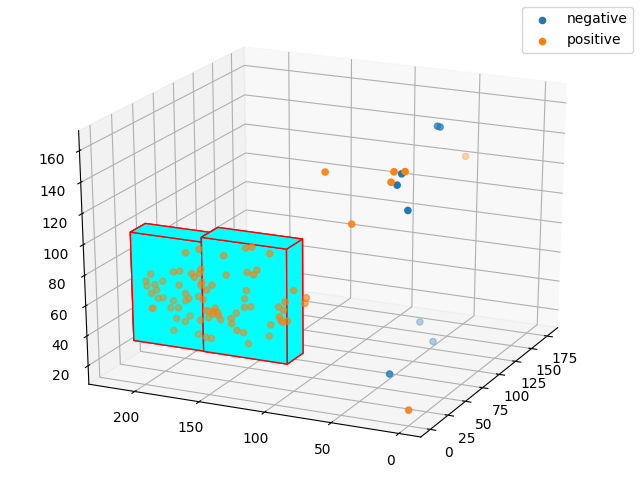

**Advanced color detecting tool for OpenCV**

When we detect color on the image in opencv we use `cv2.inRange` function like in this tutorial:  
*https://henrydangprg.com/2016/06/26/color-detection-in-python-with-opencv/*

However, sometimes accuracy of this approach is not satisfactory. Also it is usually difficult to define the range.

In this code I use multiple `cv2.inRange` calls in different regions of color space:  
  
*Points represent colors in {H,S,V} coordinates. Boxes represent ranges.*

**How it works**

To define these multiple ranges I have written code which optimizes this choice using pre-collected data.  
To collect color data from input images, launch `collect_color_data.py` and click left mouse key on colors which you need. To collect negative data points use middle mouse button. Negative points have no effect on color detecting, they are needed only if you want to see them on the plot.

**Testing**

For images present here, dataset is already collected, just launch `test.py` to see how it works.  
To test on your own images, load them to `input_data` folder, delete `color_dataset`, launch `collect_data.py` and collect your points. Then launch `test.py`.

**Usage**

To use this code in your project you will need only `color_detector.py`.  
```Python
from color_detector import ColorDetector
```
Load color dataset from file:
```Python
# init array
positives = []
# read data
for line in open('color_dataset').readlines():
	h, s, v, result = map(float, line[:-1].split('\t'))
	if result > 0.5:
		positives.append([h,s,v])
```
Use color dataset to create detector object:
```Python
cd_green = ColorDetector(positives)
```
*That's it!* Now to use the detector, call `get_mask`:
```Python
mask = cd_green.get_mask(image)
```
Now you have binary mask of image.  

**Analysis**  
To see which ranges were created, write:
```Python
print(cd_green.ranges)
```
output is a list of two (in this example) ranges:
```Python
[(array([  27.28966087,  160.95680175,   24.2726661 ]), array([  45.71033913,  226.04319825,   96.7273339 ])), (array([  27.12217638,  106.1456087 ,   24.15146678]), array([  47.87782362,  170.8543913 ,   99.84853322]))]
```
